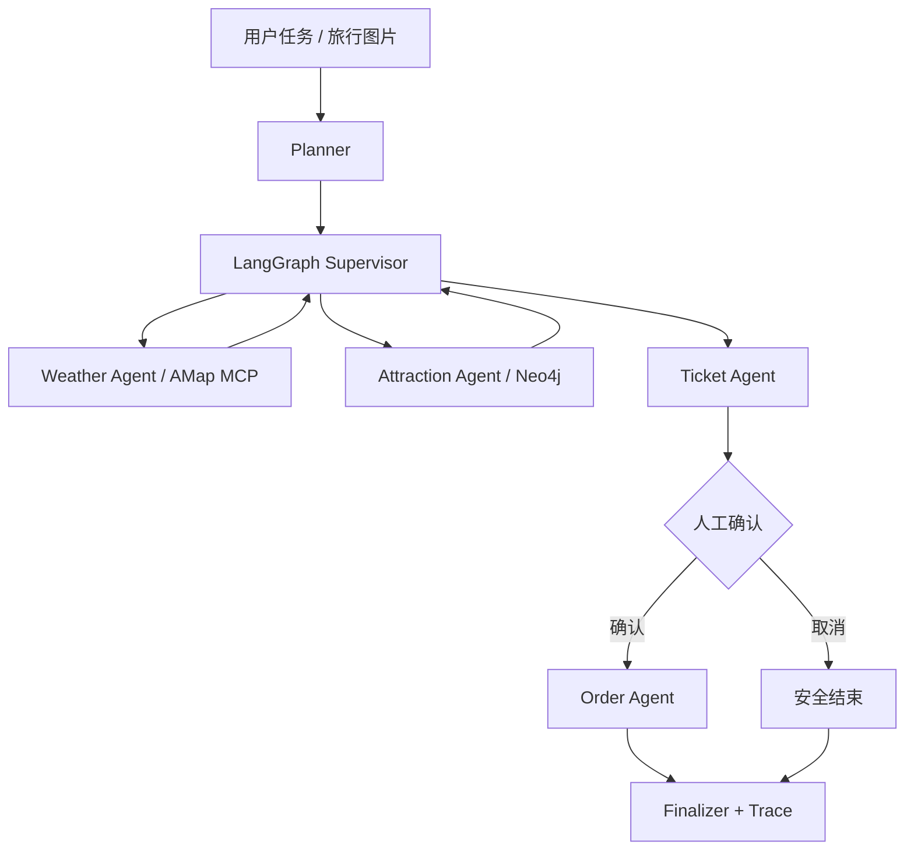

# SmartVoyage

基于 LangGraph 的多智能体旅行助手，将天气、景点、票务、知识图谱、视觉理解和人工确认组织为可观察的工作流。

## 核心能力

- LangGraph Supervisor：根据共享状态动态调度 Weather、Attraction、Ticket 与 Order 节点
- 实时天气：高德官方 MCP `maps_weather`，支持今天、明天、后天与多日预报
- 知识图谱：Neo4j 存储 30 个城市、70 个景点及关系，数据库不可用时安全降级
- 多模态：Qwen-VL 识别旅行图片，结合图谱补全地点信息并生成行程
- MCP / A2A：保留原项目工具服务与智能体通信实现
- Human-in-the-loop：订票流程在执行前暂停，公开演示不会产生真实订单
- 长期偏好与评测：支持用户偏好存储及离线工作流评测集



## 快速启动

```bash
python -m venv .venv
source .venv/bin/activate  # Windows: .venv\Scripts\activate
pip install -r requirements-demo.txt
cp .env.example .env
uvicorn SmartVoyage.demo_api:app --host 0.0.0.0 --port 6010
```

没有配置 Neo4j 时，景点查询会使用内置只读图谱；没有配置天气或视觉模型密钥时，对应能力会返回明确的不可用状态。

## Neo4j 初始化

```bash
export NEO4J_URI=bolt://127.0.0.1:7687
export NEO4J_USER=neo4j
export NEO4J_PASSWORD=your-password
python scripts/seed_neo4j.py
```

## API

```bash
curl http://localhost:6010/health
curl -X POST http://localhost:6010/api/query \
  -H "Content-Type: application/json" \
  -d '{"query":"查询北京明天天气并推荐景点"}'
```

- `POST /api/query`：运行旅行工作流
- `POST /api/confirm`：继续或取消人工确认节点
- `POST /api/analyze-image`：识别旅行图片、查询图谱并生成行程

## 测试

```bash
python -m unittest \
  SmartVoyage.test.test_amap_weather \
  SmartVoyage.test.test_coordinator_graph \
  SmartVoyage.test.test_demo_api \
  SmartVoyage.test.test_multimodal
```

## 目录

- `SmartVoyage/coordinator/`：规划、Supervisor、节点和状态模型
- `SmartVoyage/amap_weather.py`：高德 MCP/REST 天气适配
- `SmartVoyage/neo4j_graph.py`：Neo4j 图谱与静态降级
- `SmartVoyage/multimodal.py`：VLM 图片理解链路
- `SmartVoyage/demo_api.py`：公开演示 API
- `SmartVoyage/evaluation/`：离线评测框架与数据
- `scripts/seed_neo4j.py`：图谱初始化脚本

## 在线演示

[AI 项目作品集](https://u641264-9980-6bfc1315.sha1.seetacloud.com:8443/projects/smartvoyage)

> 票务数据与订单均为安全演示数据，不会执行真实购买。
